# Spring & Springboot
## Spring
### Configuration
- Dependencies needed are:
    - spring-core
    - spring-context
- In resources package: create any xml with below snippet:
    ```xml
    <?xml version="1.0" encoding="UTF-8"?>
    <beans xmlns="http://www.springframework.org/schema/beans"
        xmlns:xsi="http://www.w3.org/2001/XMLSchema-instance"
        xsi:schemaLocation="
            http://www.springframework.org/schema/beans http://www.springframework.org/schema/beans/spring-beans.xsd">

            ------------ <bean tags>
    </beans>
    ```
### Bean Creation:
- Create any class of your own.
    ```java
    package car.example.bean;

    public class MyBean {
        private String message;

        public void setMessage(String message) {
            this.message = message;
        }

        public void showMessage(){
            System.out.println("Message " + message);
        }

        @Override
        public String toString() {
            return "MyBean{" +
                    "message='" + message + '\'' +
                    '}';
        }
    }
    ```
- Now in resources/beanConfig.xml, we will configure the bean:
    ```xml
    <!-- Simple Bean -->
    <bean id="myBean" class="car.example.bean.MyBean">
        <property name="message" value="Value set from xml" />
    </bean>
    <!-- Simple Bean -->
    ```
    - id: object name
    - class: path of that class
    - property: object's properties [here it is message]
- Now in main method, we will create spring context.
    ```java
    package car.example.bean;

    import org.springframework.context.ApplicationContext;
    import org.springframework.context.support.ClassPathXmlApplicationContext;

    public class App {
        public static void main(String[] args) {
            ApplicationContext context = new ClassPathXmlApplicationContext("applicationBeanContext.xml");
            MyBean myBean = (MyBean) context.getBean("myBean");
            System.out.println("Actual bean value----");
            System.out.println(myBean);
            System.out.println("Bean after message is changed from App----");
            myBean.setMessage("MyBean set from context");
            System.out.println(myBean);
            
            /*
            ==================================================
            Console output is:
            Actual bean value----
            MyBean{message='Value set from xml'}
            Bean after message is changed from App----
            MyBean{message='MyBean set from context'}
            ==================================================
            */
        }
    }
    ```
    - So here, value to message is set from xml file and same id name has to give to getBean, else it will throw an error.

### Dependency Injection:
#### Constructor Injection:
- Now let's say there is Specification class is needed for Car class and there are as follows:
- Specification.java:
    ```java
    package car.injection.constructor;

    public class Specification {
        private String brand;
        private String model;

        public void setBrand(String brand) {
            this.brand = brand;
        }

        public void setModel(String model) {
            this.model = model;
        }

        @Override
        public String toString() {
            return "Specification{" +
                    "brand='" + brand + '\'' +
                    ", model='" + model + '\'' +
                    '}';
        }
    }
    ```

- Car.java
    ```java
    package car.injection.constructor;

    public class Car {

        private Specification specification;

        public Car(Specification specification) {
            this.specification = specification;
        }

        public void getDetails(){
            System.out.println(specification.toString());
        }
    }
    ```
- Now in Spring, Inverse of Control [IoC], takes care of object creation and maintain them. So for that we need xml configuration as follows:
    ```xml
    <!--    Constructor Injection-->
    <bean id="toyatoSpecification" class="car.injection.constructor.Specification">
        <property name="brand" value="Toyato by Constructor" />
        <property name="model" value="Glanza by Constructor" />
    </bean>

    <bean id="toyatoCar" class="car.injection.constructor.Car" >
        <constructor-arg ref="toyatoSpecification" />
    </bean>
    <!--    Constructor Injection-->
    ```
    - Specification is just like some normal bean creation but for injection of that bean into another bean, we need 
    **constructor-arg** tag and ref value should be as same as id of bean which we need to inject. 
        - So specification bean name is **toyatoSpecification** and in **toyatoCar** car bean, we want toyatoSpecification bean so we used **toyatoSpecification**.
- Now in main method, we can refer toyatoCar bean and their console outputs are as follows:
    ```java
    package car.injection.constructor;

    import org.springframework.context.ApplicationContext;
    import org.springframework.context.support.ClassPathXmlApplicationContext;

    public class App {
        public static void main(String[] args) {
            ApplicationContext context = new ClassPathXmlApplicationContext("applicationBeanContext.xml");
            Car toyato = (Car) context.getBean("toyatoCar");
            toyato.getDetails();
            /* 
            
            Specification{brand='Toyato by Constructor', model='Glanza by Constructor'}

            */
        }
    }
    ```
- Important step in constructor injection is:
    - In Car.java, we inject Specification in constructor as follows:
    ```java
    public Car(Specification specification) {
            this.specification = specification;
    }
    ```
    - In Xml:
    ```xml
     <constructor-arg ref="toyatoSpecification" />
    ```

#### Setter Injection:
- Now let's say there is Specification class is needed for Car class and there are as follows:
- Specification.java: [remains same]
    ```java
    package car.injection.constructor;

    public class Specification {
        private String brand;
        private String model;

        public void setBrand(String brand) {
            this.brand = brand;
        }

        public void setModel(String model) {
            this.model = model;
        }

        @Override
        public String toString() {
            return "Specification{" +
                    "brand='" + brand + '\'' +
                    ", model='" + model + '\'' +
                    '}';
        }
    }
    ```

- Car.java [instead of constructor, getter and setter are added]
    ```java
    package car.injection.constructor;

    public class Car {

        private Specification specification;

        public Specification getSpecification() {
            return specification;
        }

        public void setSpecification(Specification specification) {
            this.specification = specification;
        }

        public void getDetails(){
            System.out.println(specification.toString());
        }
    }
    ```
- Now in Spring, Inverse of Control [IoC], takes care of object creation and maintain them. So for that we need xml configuration as follows:
    - specification bean is same but for understanding I made it to Mahindra and Thar
    ```xml
    <!--    Setter Injection-->
    <bean id="mahindraSpecification" class="car.injection.setter.Specification">
        <property name="brand" value="Mahindra by Setter" />
        <property name="model" value="Thar by Setter" />
    </bean>

    <bean id="mahindraCar" class="car.injection.setter.Car" >
        <property name="specification" ref="mahindraSpecification" />
    </bean>
    <!--    Setter Injection-->
    ```
    - Specification is just like some normal bean creation but for injection of that bean into another bean in setter way, we need normal **property** but since it is injection, instead of name and value, here we use **ref** attribute.
- Now in main method, we can refer toyatoCar bean and their console outputs are as follows:
    ```java
    package car.injection.constructor;
    package car.injection.setter;

    import org.springframework.context.ApplicationContext;
    import org.springframework.context.support.ClassPathXmlApplicationContext;

    public class App {
        public static void main(String[] args) {
            ApplicationContext context = new ClassPathXmlApplicationContext("applicationBeanContext.xml");
            Car mahindraCar = (Car) context.getBean("mahindraCar");
            mahindraCar.getDetails();

            /*
            
            Specification{brand='Mahindra by Setter', model='Thar by Setter'}
            
            */
        }
    }
    ```

- Important step in setter injection is:
    - In Car.java, we inject Specification in setter as follows:
    ```java
    public Specification getSpecification() {
        return specification;
    }

    public void setSpecification(Specification specification) {
        this.specification = specification;
    }
    ```
    - In Xml:
    ```xml
     <property name="specification" ref="mahindraSpecification" />
    ```

### Autowiring:
- We want to autowire Specification class into Car class and it can be done by many ways. Both Car and Specification are same for all. Only difference is in configuration in XML files. Autowiring can be done by: byName || byType || constructor
- For byName and byType, dependency is injected by **setter** type and for constructor type, it is by constructor. Car and Specification classes are same for both byName and byType and are as follows:
    - Car.java
    ```java
    package car.autowire.byName;

    public class Car {

        private Specification specification;

        public Specification getSpecification() {
            return specification;
        }

        public void setSpecification(Specification specification) {
            this.specification = specification;
        }

        public void getDetails(){
            System.out.println(specification.toString());
        }
    }
    ```
    - Specification.java
    ```java
    package car.autowire.byName;

    public class Specification {
        private String brand;
        private String model;

        public void setBrand(String brand) {
            this.brand = brand;
        }

        public void setModel(String model) {
            this.model = model;
        }

        @Override
        public String toString() {
            return "Specification{" +
                    "brand='" + brand + '\'' +
                    ", model='" + model + '\'' +
                    '}';
        }
    }
    ```
    
#### ByName:
- autowiringByName.xml
    ```xml
    <!--    Autowire Injection by Name-->
    <bean id="specification" class="car.autowire.byName.Specification">
        <property name="brand" value="Car brand by autoname by name" />
        <property name="model" value="Car model by autoname by name" />
    </bean>

    <bean id="autoWireByNameCar" class="car.autowire.byName.Car" autowire="byName" />
    <!--    Autowire Injection by Name-->
    ```
- Here **autowire="byName"** looks for any other classes there in Car class and here it is 
    ```java
    private Specification specification;
    ``` 
    and checks for bean named as like there in class and here it is **specification**.
- App.java
    ```java
    package car.autowire.byName;

    import org.springframework.context.ApplicationContext;
    import org.springframework.context.support.ClassPathXmlApplicationContext;

    public class App {
        public static void main(String[] args) {
            ApplicationContext context = new ClassPathXmlApplicationContext("autowiringByName.xml");
            Car autoWireByNameCar = (Car) context.getBean("autoWireByNameCar");
            autoWireByNameCar.getDetails();
            /*
            
            Specification{brand='Car brand by autoname by name', model='Car model by autoname by name'}

            */
        }
    }
    ```
- Important Steps:
    - Autowiring is done by Name but key point to note here is that bean is injected into Car class here by **setter**.
    - If there is another bean named **specification1**, so as to get that injected, Car code should refer **specification1** instead of **specification**.
        ```java
        private Specification specification1;
        // and its corresponding getter and setter.
        ```

#### ByType:
- autowiringByType.xml
    ```xml
    <!--    Autowire Injection by Type-->
    <bean id="specification" class="car.autowire.byType.Specification">
        <property name="brand" value="CarBrand | byType | specification"/>
        <property name="model" value="CarModel | byType | specification"/>
    </bean>

    <bean id="specification1" class="car.autowire.byType.Specification">
        <property name="brand" value="CarBrand | byType | specification1"/>
        <property name="model" value="CarModel | byType | specification1"/>
    </bean>
    <bean id="myCar" class="car.autowire.byType.Car" autowire="byType"/>
    <!--    Autowire Injection by Type-->
    ```
    - Here 
        - Car bean: myCar
        - Specification beans are:
            - specification
            - specification1
    - In myCar bean, **autowire="byType"** checks for **private Specification specification** i.e for beans of type Specification class but here we have 2 beans namely **specification** and **specification1** and if we try to inject Specification bean, it will get confuse between which bean to get injected and throws an error
        ```
        Caused by: org.springframework.beans.factory.NoUniqueBeanDefinitionException: No qualifying bean of type 'car.autowire.byType.Specification' available: expected single matching bean but found 2: specification,specification1
        ```
    - For now comment out any specification and run it.
- App.java
    ```java
    package car.autowire.byType;

    import org.springframework.context.ApplicationContext;
    import org.springframework.context.support.ClassPathXmlApplicationContext;

    public class App {
        public static void main(String[] args) {
            ApplicationContext context = new ClassPathXmlApplicationContext("autowiringByType.xml");
            Car autoWireByNameCar = (Car) context.getBean("myCar");
            autoWireByNameCar.getDetails();
            
            // Specification{brand='CarBrand | byType | specification', model='CarModel | byType | specification'}
        }
    }
    ```
- Important Steps:
    - Autowiring is done by Type but key point to note here is that bean is injected into Car class here by **setter**.

#### ByConstructor:
- Here dependency is injected by constructor and Specification.java remains same but Car.java is as follows:
    ```java
    package car.autowire.byConstructor;

    public class Car {

        private final Specification specification;

        public Car(Specification specification) {
            this.specification = specification;
        }

        public void getDetails(){
            System.out.println(specification.toString());
        }
    }
    ```
- autoWiringByConstructor.xml
    ```xml
    
    <!--    Autowire Injection by constructor-->
    <bean id="specification1" class="car.autowire.byConstructor.Specification">
        <property name="brand" value="CarBrand | byConstructor | specification"/>
        <property name="model" value="CarModel | byConstructor | specification"/>
    </bean>
    <bean id="myCar" class="car.autowire.byConstructor.Car" autowire="constructor"/>
    <!--    Autowire Injection by constructor-->
    ```
    - **autowire="constructor"** looks for constructor and looks for bean of that class no matter what name of that it is.
- App.java
    ```java
    package car.autowire.byConstructor;

    import org.springframework.context.ApplicationContext;
    import org.springframework.context.support.ClassPathXmlApplicationContext;

    public class App {
        public static void main(String[] args) {
            ApplicationContext context = new ClassPathXmlApplicationContext("autowiringByConstructor.xml");
            Car autoWireByNameCar = (Car) context.getBean("myCar");
            autoWireByNameCar.getDetails();

            // Specification{brand='CarBrand | byConstructor | specification', model='CarModel | byConstructor | specification'}
        }
    }
    ```

### By Annotation
#### @Component, @ComponentScan, @Autowired, @Value, @Qualifier
##### XML Based:
- Here we don't create any beans by we configure a package and in that when there is any class has annotation **@Component** on top of that class, bean will be created automatically. 
    - If class is Car, bean will be car
    - If class is Employee, bean is employee
- Specification.java
    ```java
    package car.annotations;

    import org.springframework.stereotype.Component;

    @Component
    public class Specification {
        private String brand;
        private String model;

        public void setBrand(String brand) {
            this.brand = brand;
        }

        public void setModel(String model) {
            this.model = model;
        }

        @Override
        public String toString() {
            return "Specification{" +
                    "brand='" + brand + '\'' +
                    ", model='" + model + '\'' +
                    '}';
        }
    }
    ```
    - Code is same, only change is **@Component** is added on top of the class.
        ```java
        @Component
        public class Specification {
            /*
            
            <---Same Code --->
            
            */
        }
        ```
- Car.java code is same but only change is tag 
    ```java
    package car.annotations;

    import org.springframework.beans.factory.annotation.Autowired;
    import org.springframework.stereotype.Component;

    @Component
    public class Car {

    //    @Autowired
        private Specification specification;

        @Autowired
        public Car(Specification specification) {
            this.specification = specification;
        }

        public void getDetails(){
            System.out.println(specification.toString());
        }
    }
    ```
    - Code changes are:
        - @Component on top of class
            ```java
            @Component
            public class Car {
                /*
    
                <---Same Code --->
                
                */
            }
            ```
        - @Autowired can be on either constructor or field [anything is fine]
            - field level autowiring
                ```java
                @Autowired
                private Specification specification;
                ```
            - constructor level autowiring
                ```java
                @Autowired
                public Car(Specification specification) {
                    this.specification = specification;
                }
                ```
- resources/annotationConfig.xml: This config is different for annotation based and is as follows:
    ```xml
    <?xml version="1.0" encoding="UTF-8"?>
    <beans xmlns="http://www.springframework.org/schema/beans"
        xmlns:xsi="http://www.w3.org/2001/XMLSchema-instance"
        xmlns:context="http://www.springframework.org/schema/context"
        xsi:schemaLocation="http://www.springframework.org/schema/beans
            https://www.springframework.org/schema/beans/spring-beans.xsd
            http://www.springframework.org/schema/context
            https://www.springframework.org/schema/context/spring-context.xsd">

        <context:component-scan base-package="car.annotations"/>

    </beans>
    ```
    - Extra added tag is 
        ```xml
        <context:component-scan base-package="car.annotations"/>
        ```
        - Here for base-package, package to be added and in that beans will be created for whatever the classes for which **@Component** are added.
- App.java
    ```java
    package car.annotations;

    import org.springframework.context.ApplicationContext;
    import org.springframework.context.support.ClassPathXmlApplicationContext;

    public class App {
        public static void main(String[] args) {
            ApplicationContext context = new ClassPathXmlApplicationContext("annotationConfig.xml");
            Car autoWireByNameCar = (Car) context.getBean("car");
            autoWireByNameCar.getDetails();

            // Specification{brand='null', model='null'}
        }
    }
    ```
- In console, since no value is there, we can assign default value to the object properties using **@Value** annotation.
    - Assigning normal default values:
        ```java
        @Value("Default Brand")
        private String brand;

        // brand='Default Brand'
        ```
    - Assinging expression [like mathematical]
        ```java
        @Value("#{4+4}")
        private String model;

        // model='8'
        ```
    - Assinging any system variables
        ```java
        @Value("${java.home}")
        private String model;

        // model='C:\Program Files\Eclipse Adoptium\jdk-21.0.8.9-hotspot'
        ```
- @Qualifier
    - Whenever there are more than 1 bean of same type but we want to refer particular one, then this annotation can be used, just add along Autowired at field level.
    - It can't be placed on top of constructor.
        ```java
        @Autowired
        @Qualifier("specification")
        private Specification specification;
        ```

## Springboot
### Spring Boot Architecture Overview
- The relationship between Spring Boot and the core Spring Framework can be summarized by the following equation:
- Springboot is combination of: 
    - Spring framework
        - Provides the foundational core features like Dependency Injection (DI) and Inversion of Control (IoC).
    - Pre-built Configuration
        - Eliminates heavy boilerplate and XML setup through automatic "opinionated" defaults.
    - Embedded Servers
        - Includes built-in servers (like Tomcat or Jetty) so applications can run independently as standalone `.jar` files.

#### Application launch:
- In project, there is a class with an annotation tagged with **@SpringBootApplication**. And this class contains main method.
- On running this class, we will get following logs:
    - Spring ASCII Banner
        ```
        .   ____          _            __ _ _
        /\\ / ___'_ __ _ _(_)_ __  __ _ \ \ \ \
        ( ( )\___ | '_ | '_| | '_ \/ _` | \ \ \ \
        \\/  ___)| |_)| | | | | || (_| |  ) ) ) )
        '  |____| .__|_| |_|_| |_\__, | / / / /
        =========|_|==============|___/=/_/_/_/
        ```
    - Springboot version
        ```
        :: Spring Boot ::                (v4.1.1)
        ```
    - Environment log i.e profile 
        ```
        No active profile set, falling back to 1 default profile: "default"
        ```
    - Server launched portal:
        ```
        Tomcat initialized with port 8080 (http)
        ```
    - Context path log:
        ```
        Tomcat started on port 8080 (http) with context path '/'
        ```
        - i.e if context path is /app then
            **http://localhost:8080/home** will become **http://localhost:8080/app/home**
- @RestController:
    - To map some class as Rest API, we have to tag that class with **@RestController** and it is combination of:
        - @Controller
        - @ResponseBody
- @GetMapping:
    - Response as normal text:
        ```java
        package com.gomad.springboot_basic;

        import org.springframework.web.bind.annotation.GetMapping;
        import org.springframework.web.bind.annotation.RestController;

        @RestController
        public class HomeController {

            @GetMapping("/home")
            public String HomePage(){
                return "Hello Home..!";
            }
        }
        ```
    - URL: **http://localhost:8080/home**
    - Response: Hello Home..!
    ---
    - Response as JSON: 
        ```java
        package com.gomad.springboot_basic;

        import org.springframework.web.bind.annotation.GetMapping;
        import org.springframework.web.bind.annotation.RestController;

        @RestController
        public class HomeController {

            public static class HomeResponse{
                private String message;

                public HomeResponse(String message) {
                    this.message = message;
                }

                public String getMessage() {
                    return message;
                }

                public void setMessage(String message) {
                    this.message = message;
                }
            }

            @GetMapping("/homeAsJson")
            public HomeResponse HomePageAsJson(){
                return new HomeResponse("Hello Home as Json..!");
            }
        }
        ```
    - URL: **http://localhost:8080/homeAsJson**
    - Response:
        ```json
        {
            "message": "Hello Home as Json..!"
        }
        ```

- @PostMapping and @RequestBody
    ```java
    @PostMapping("/post-home-json")
    public HomeResponse postHomePage(@RequestBody String message){
        return new HomeResponse(message);
    }
    ```
    - URL: /post-home-json
    - Response: 
        ```json
        {
            "message": "Hello welcome to world"
        }
        ```
- Note: 
    - There is **jackson** library which can convert class object as JSON response.
- @PathVariable:
    ```java
    @GetMapping("/home/{name}")
    public HomeResponse homePageWithPathParam(@PathVariable String name){
        return new HomeResponse("Hello " + name + "..!");
    }
    ```
    - URL: /home/govind
    - Response:
        ```json
        {   
            "message": "Hello govind..!"
        }
        ```
- @RequestParam
    ```java
    
    @GetMapping("/home-path-param")
    public HomeResponse homePutResponse(@RequestParam("name") String name) {
        return new HomeResponse("Hello " + name + "..!");
    }
    ```
    - URL: /home-path-param?name=govind
    - Response:
        ```json
        {   
            "message": "Hello govind..!"
        }
        ```
## Ecom Project
### Architecture:
- Architecture1
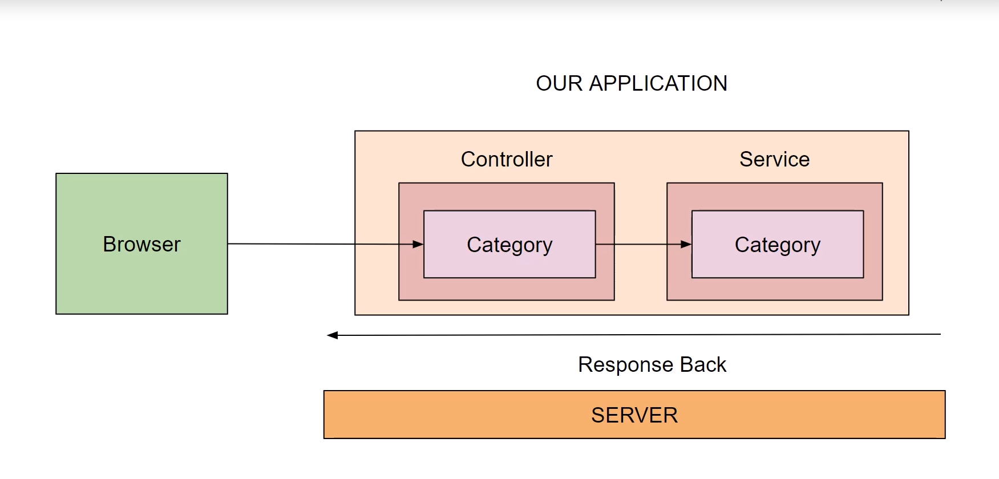
- Our Application Architecture
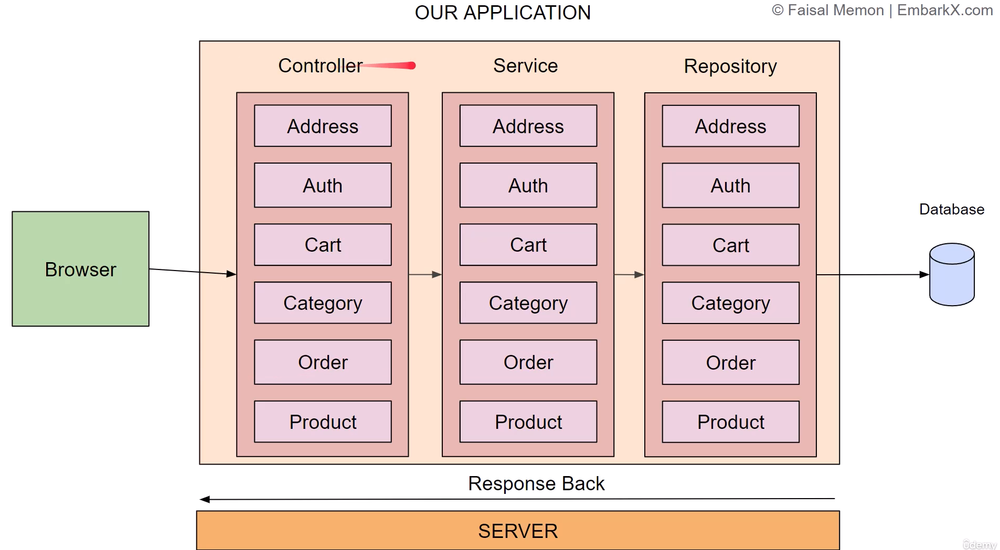
- Category API Contract
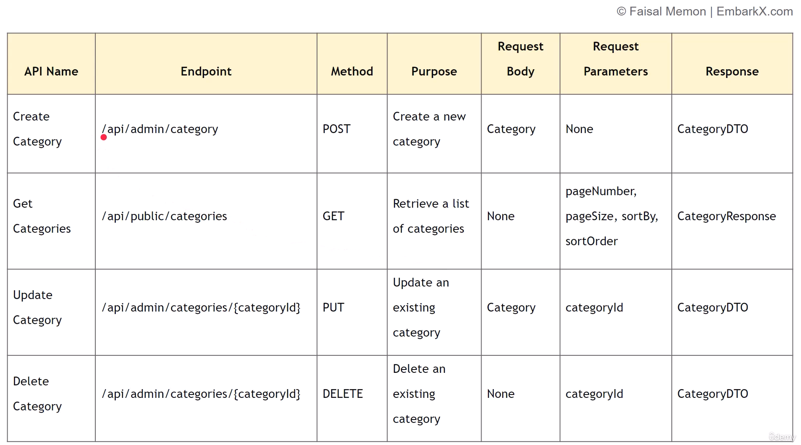

### Project Architecture:
- API Request ==> [Controller(C)] ==> [Service(I)] ==> [Implementation(C)]
    - C: class
    - I: Interface
- Example: /categories/all
    - controller/Category => service/CategoryService => implementation/CategoryServiceImplementation
- Our end point are http://localhost:8080/api/public and context path **/api/public** and in application.properties
    ```
    server.servlet.context-path=/api/public
    ```
- **/category/all**
    - Using GetMapping and ResponseEntity class itself
        ```java
        @RestController
        @RequestMapping("/category")
        public class CategoryController {

            @Autowired
            private CategoryService categoryService;

            @GetMapping("/all")
            public ResponseEntity<List<Category>> getCategories(){
                return ResponseEntity.ok().body(categoryService.getAllCategories());
            }
        }
        ```
    - Using RequestMapping and ResponseEntity object
        ```java
        @RestController
        @RequestMapping("/category")
        public class CategoryController {

            @Autowired
            private CategoryService categoryService;

            @RequestMapping(value = "/all", method = RequestMethod.GET)
            public ResponseEntity<List<Category>> getCategories(){
                return new ResponseEntity<>(categoryService.getAllCategories(), HttpStatus.OK);
            }
        }
        ```
    - Note: 
        - Both ```@RequestMapping(value = "/all", method = RequestMethod.GET)``` and ```@GetMapping("/all")``` works the same.
        - Also ```return new ResponseEntity<>(categoryService.getAllCategories(), HttpStatus.OK);``` and ```return ResponseEntity.ok().body(categoryService.getAllCategories());``` works same.
        - Here Field type autowiring is used.
            ```java
            @Autowired
            private CategoryService categoryService;
            ```
    - Service class for this is:
        ```java
        public interface CategoryService {
            List<Category> getAllCategories();
            boolean createCategory(Category category);
            boolean updateCategory(Long id, Category category);
            boolean deleteCategory(Long id);
            Category getCategoryById(Long id);
        }
        ```
    - Here Category model is getting used:
        ```java
        package com.gomad.eCom.model;

        public class Category {
            // 1. Change primitive long to wrapper Long object
            private Long id;
            private String categoryName;

            // 2. REQUIRED: Default no-argument constructor for Jackson deserialisation
            public Category() {
            }

            public Category(String categoryName, Long id) {
                this.categoryName = categoryName;
                this.id = id;
            }

            // Update getter and setter to use Long wrapper
            public Long getId() {
                return id;
            }

            public void setId(Long id) {
                this.id = id;
            }

            public String getCategoryName() {
                return categoryName;
            }

            public void setCategoryName(String categoryName) {
                this.categoryName = categoryName;
            }

            @Override
            public String toString() {
                return "Category{" +
                        "id=" + id +
                        ", categoryName='" + categoryName + '\'' +
                        '}';
            }
        }
        ```
    - Implementation class of **CategoryService** is:
        ```java
        package com.gomad.eCom.implementation;

        import com.gomad.eCom.model.Category;
        import com.gomad.eCom.service.CategoryService;
        import org.springframework.stereotype.Service;

        import java.util.ArrayList;
        import java.util.List;
        import java.util.Optional;

        @Service
        public class CategoryServiceImplementation implements CategoryService {
            private final List<Category> categories = new ArrayList<>();
            private long nextId = 1L;

            @Override
            public List<Category> getAllCategories() {
                return categories;
            }
        }
        ```
- Common operations and other code needed in implementation is:
    - Filtering: 
        ```java
        @Override
        public boolean updateCategory(Long id, Category category) {
            Category cat = categories.stream()
                    .filter(c -> c.getId().equals(id))
                    .findFirst()
                    .orElse(null);
            if (cat == null){
                return false;
            }

            cat.setCategoryName(category.getCategoryName());
            return true;
        }
        ```
        - Here **stream** is used.
        - For ```orElse(null)```, we can throw error with status like:
            ```java
            .orElseThrow(() -> new ResponseStatusException(HttpStatus.NOT_FOUND, "Record not found"));
            ```
    - Optional:
        ```java
         public Category getCategoryById(Long id) {
            Optional<Category> optionalCategory = categories.stream()
                    .filter(c -> c.getId().equals(id))
                    .findFirst();
            return optionalCategory.orElse(null);

            (or)

            if(optionalCategory.isPresent()){
                return optionalCategory.get();
            } else{
                return null;
            }
        }
        ```
        - Optional will have either value or empty:
            - **optionalCategory.isPresent()** is used to check it is empty or not.
            - **optionalCategory.get()** can be used to get data. 
## Database integration:
### ORM [Object Resource Mapping]
- Whenever this is a Java Class, that class can be automatically converted to a table with its attributes being converted to columns.
- Example: 
    - Customer Class
        - id: integer
        - f_name: String
        - l_name: String
    
    - customer_1:
        - id: 1
        - f_name: "AAAA"
        - l_name: "aaaa"

    - customer_2:
        - id: 2
        - f_name: "BBBB"
        - l_name: "bbbb"
    - customer_3:
        - id: 3
        - f_name: "CCCC"
        - l_name: "cccc"
        ```
        +------------+----+---------+--------+
        | Customer   | ID | F_NAME  | L_NAME |
        +------------+----+---------+--------+
        | customer_1 | 1  | AAAA    | aaaa   |
        | customer_2 | 2  | BBBB    | bbbb   |
        | customer_3 | 3  | CCCC    | cccc   |
        +------------+----+---------+--------+c
        ```
- So now developers doesn't have to write queries for table creation, it will be created automatically.
- Whenever an object is created, its data can be saved in the database as a row in the table, this is automatically handled by ORM.
- ORM as a concept makes developers' lives easier and lets developers focus on application logic rather than SQL queries.
- Because of ORM, developers don't need to learn how to write SQL queries since the translation from application to SQL is handled by ORM itself. 

### JPA [Java Persistence API]
- It allows your application to interact with the database and do all the sort of stuff that any application would want to do.
- Advantages:
    - Easy and Simple
    - Makes querying easier.
    - Allows to save and update objects.
    - Easy integration with Springboot.
### MVP:
- Presentation Layer: [View (V)]
    - It represents the data and the application features to the user. This is the layer where in all the controller classes exist.
- Service Layer: [Controller (C)]
    - It is where the business logic resides in the application. Tasks such as evaluations, decision making, process of data is done at this layer.
- Data Access Layer: [Model (M)]
    - It is the layer where all the repository classes reside.
    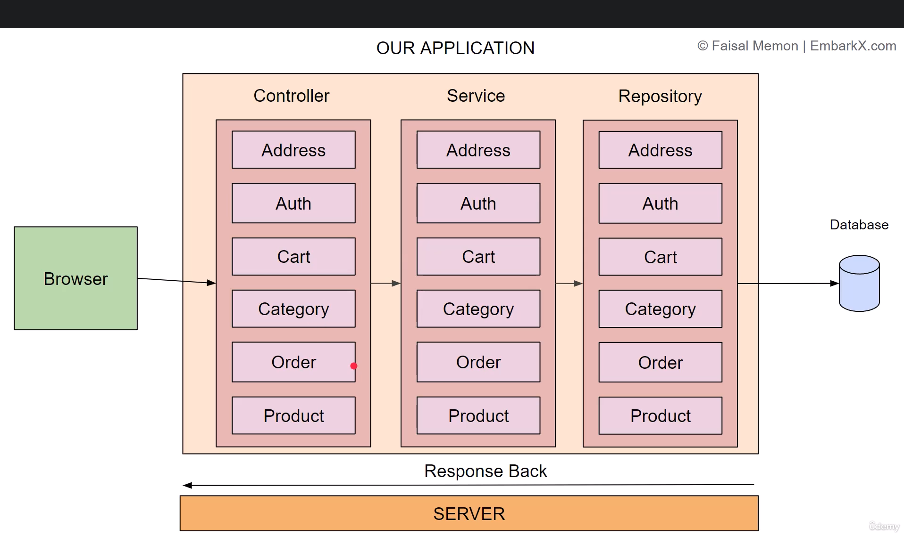

### H2 Database Engine
- H2 is the Java SQL database. The main features of H2 are:

    - Very fast, open source, JDBC API
    - Embedded and server modes; in-memory databases
    - Browser based Console application
    - Small footprint: around 2.5 MB jar file size
    - Transaction support, multi-version concurrency
- Dependencies needed are:
    - H2
    - JPA
- Without configuration, on starting project, following logs come:
    ```
    HikariPool-1 - Added connection conn0: url=jdbc:h2:mem:3ce69e46-7acf-4144-94dd-34ad7a64e287 user=SA
    
    HHH10001005: Database info:
	Database JDBC URL [jdbc:h2:mem:3ce69e46-7acf-4144-94dd-34ad7a64e287]
	Database driver: H2 JDBC Driver
	Database dialect: H2Dialect
	Database version: 2.4.240
	Default catalog/schema: 3CE69E46-7ACF-4144-94DD-34AD7A64E287/PUBLIC
	Autocommit mode: undefined/unknown
	Isolation level: READ_COMMITTED [default READ_COMMITTED]
	JDBC fetch size: 100
	Pool: DataSourceConnectionProvider
	Minimum pool size: undefined/unknown
	Maximum pool size: undefined/unknown
    ```
- With configuration in **application.properties**:
    - **spring.h2.console.enabled=true**
    ```
    HikariPool-1 - Added connection conn0: url=jdbc:h2:mem:a4596c87-2631-44eb-8491-41abb611ee3c user=SA

    HHH10001005: Database info:
	Database JDBC URL [jdbc:h2:mem:a4596c87-2631-44eb-8491-41abb611ee3c]
	Database driver: H2 JDBC Driver
	Database dialect: H2Dialect
	Database version: 2.4.240
	Default catalog/schema: A4596C87-2631-44EB-8491-41ABB611EE3C/PUBLIC
	Autocommit mode: undefined/unknown
	Isolation level: READ_COMMITTED [default READ_COMMITTED]
	JDBC fetch size: 100
	Pool: DataSourceConnectionProvider
	Minimum pool size: undefined/unknown
	Maximum pool size: undefined/unknown


    H2 console available at '/h2-console'. Database available at 'jdbc:h2:mem:a4596c87-2631-44eb-8491-41abb611ee3c'
    ```
- Note: 
    - On every restart, this url will get changed:
-   http://localhost:8080/h2-console opens
    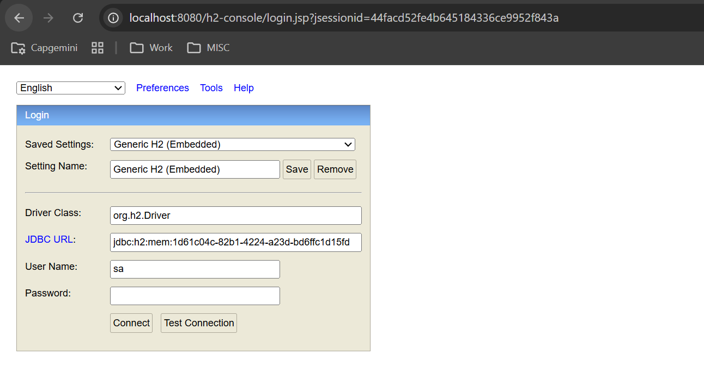
    - get JDBC URL from the console and paste in JDBC URL input like ```jdbc:h2:mem:3b38fffc-ad41-4184-8ebb-5d9c18ea84f4```
    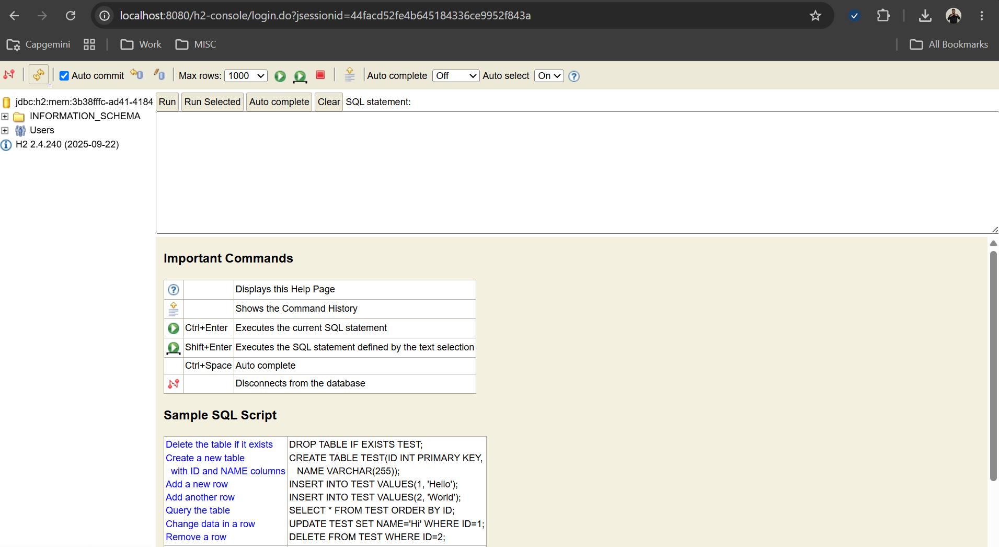
- To fix this dynamic url issue, in application.properties, add
    ```
    spring.datasource.url=jdbc:h2:mem:testdb
    ```
    - jdbc: Connection Protocol
    - h2: database
    - mem: in-memory database
    - testdb: in-memory database name.
- Now on every restart, console will have:
    ```
    HikariPool-1 - Added connection conn0: url=jdbc:h2:mem:testdb user=SA

    HHH10001005: Database info:
	Database JDBC URL [jdbc:h2:mem:testdb]
	Database driver: H2 JDBC Driver
	Database dialect: H2Dialect
	Database version: 2.4.240
	Default catalog/schema: TESTDB/PUBLIC
	Autocommit mode: undefined/unknown
	Isolation level: READ_COMMITTED [default READ_COMMITTED]
	JDBC fetch size: 100
	Pool: DataSourceConnectionProvider
	Minimum pool size: undefined/unknown
	Maximum pool size: undefined/unknown
    ```
- H2 console available at '/h2-console'. Database available at 'jdbc:h2:mem:testdb'

- Configuration of H2 Database:
    - In application.properties:
        ```
        spring.h2.console.enabled=true
        spring.datasource.url=jdbc:h2:mem:testdb
        ```

### Entity [in JPA]
- In the context of JPA, an entity represents a table in the relational database.
- A model Category [POJO] 
    ```java
    package com.gomad.h2_jpa.model;

    public class Category {
        private Long id;
        private String categoryName;
    }
- Now this can be changed into entity with **@Entity** annotation imported from **jakarta**. And the code is:
    ```java
    package com.gomad.h2_jpa.model;

    import jakarta.persistence.Entity;
    import jakarta.persistence.Id;

    @Entity
    public class Category {
        @Id
        private Long id;
        private String categoryName;
    }
    ```
    - Note: **@Id** should be annotated on atleast one field, else server will be crashed. Now in h2-console, category will be added, check in image
    - Even though JPA is not enforcing, but it's a good practice to keep default constructor.
        ```java
        // REQUIRED: Default no-argument constructor for Jackson deserialisation
        public Category() {
        }
        ```
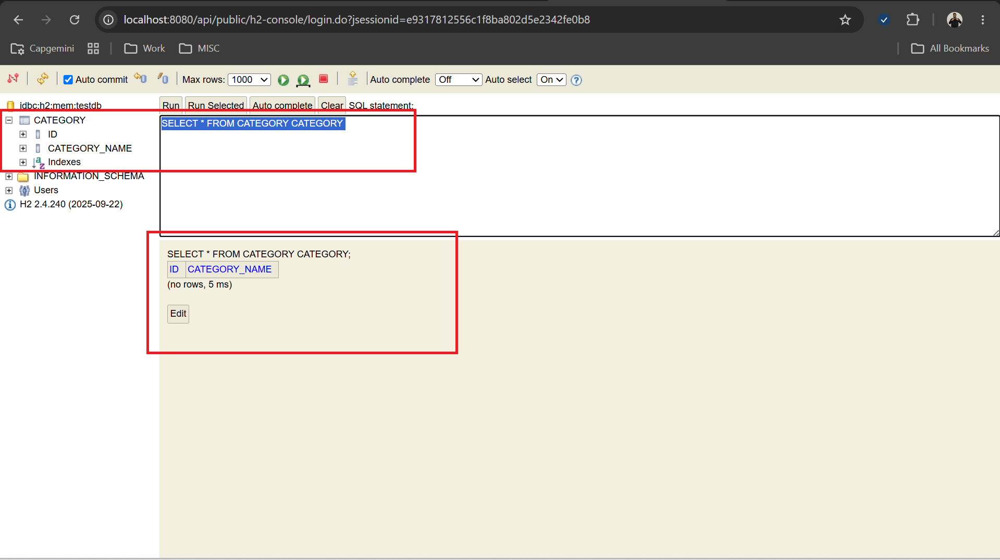
- **@Entity(name = "categories")** will create table with name **categories**
- Note:
    - In production ready code, our entities should be focused on how data is structured and stored in the database but they should not dictate how the data to be presented to the end user.
    - As long as entities are representing the data structure and how it's being represented in the database then **IT IS A PROBLEM**.
    - Example for Category, in response it will be like 
        ```json
        [
            {
                "categoryName": "Fruits",
                "id": 1
            },
            {
                "categoryName": "Vegetables",
                "id": 2
            }
        ]
        ```
    - So in case if I want some other field or to remove [like password], then with current approach, we need to add that field as column in database i.e entity is determining what to get represented. So as to handle this we use **Custom Responses**. [Click here](#custom-responses)

### Extra Configurations in SQL:
- In application.properties:
    ```
    spring.jpa.show-sql=true
    spring.jpa.properties.hibernate.format_sql=true
    ```
    - It will show SQL i.e being generated behind the scenes like as follows:
        ```
        Hibernate: 
            drop table if exists categories cascade 
        Hibernate: 
            create table categories (
                id bigint not null,
                category_name varchar(255),
                primary key (id)
            )
        ```
    - **drop table if exists categories cascade** means everytime, server restarts, database gets dropped and created newly. This can be configured by
        - **spring.jpa.hibernate.ddl-auto=OPTIONS_BELOW**, OPTIONS_BELOW are:
            - none: nothing will happens to schema
            - update: updates schema on entity change
            - create: creates new one
            - create-drop: creates on server start and drops on server stops
        - but don't need to use this.

### Generation Types for Identity

- In general, if we don't want to handle the ID generation ourselves, or don't know which strategy to use, we can use the following annotation:
  - **@GeneratedValue(strategy = GenerationType.IDENTITY)**

- Different Generation Types:
  - AUTO
  - IDENTITY
  - SEQUENCE
  - TABLE
  - NONE
  - 
- AUTO
    - Default generation strategy.
    - Tells JPA to choose the appropriate strategy based on the underlying database (such as PostgreSQL, MySQL, Oracle, etc.).
        ```java
        @Id
        @GeneratedValue(strategy = GenerationType.AUTO)
        private Long id;
        ```

- IDENTITY
    - Uses an identity column in the database to generate primary key values.
    - Supported by relational databases such as MySQL and PostgreSQL.
        ```java
        @Id
        @GeneratedValue(strategy = GenerationType.IDENTITY)
        private Long id;
        ```

- SEQUENCE
    - Uses a database sequence to generate primary key values.
    - Sequences are database objects that generate unique numeric values.
    - Commonly used in databases such as Oracle and PostgreSQL that support sequences.
        ```java
        @Id
        @GeneratedValue(strategy = GenerationType.SEQUENCE)
        private Long id;
        ```
    - Using a Custom Sequence

        - You can explicitly instruct JPA to use a specific database sequence:

            ```java
            @Id
            @GeneratedValue(strategy = GenerationType.SEQUENCE, generator = "category_seq")
            @SequenceGenerator(
                name = "category_seq",
                sequenceName = "category_sequence",
                allocationSize = 1
            )
            private Long id;
            ```
        - JPA uses generator named **category_seq** and that sequence is configured using **@SequenceGenerator**
            - name: sequence name
            - allocationSize: incremental value

- TABLE
    - Uses a separate database table to maintain and generate unique primary key values.
    - Provides database independence.
    - Generally slower compared to `IDENTITY` and `SEQUENCE`.
        ```java
        @Id
        @GeneratedValue(strategy = GenerationType.TABLE)
        private Long id;
        ```
    - This can be useful if our databases doesn't support sequence.
    - Custome Table Sequence is as like
        ```java
        @GeneratedValue(strategy = GenerationType.TABLE, generator = "cat_gen")
        @TableGenerator(
                name = "cat_gen", 
                table="id_gen",
                pkColumnName = "gen_key",
                valueColumnName = "gen_value",
                pkColumnValue = "cat_id", allocationSize = 1
        )
        ```

- NONE
    - No automatic ID generation strategy is used.
    - The application is responsible for assigning the primary key value.
    ```java
    @Id
    private Long id;
   ```
- Summary

    | Strategy | Description                              | Common Databases   |
    | -------- | ---------------------------------------- | ------------------ |
    | AUTO     | JPA chooses the strategy automatically   | Any                |
    | IDENTITY | Uses auto-increment/identity columns     | MySQL, PostgreSQL  |
    | SEQUENCE | Uses database sequences                  | Oracle, PostgreSQL |
    | TABLE    | Uses a dedicated table for ID generation | Any                |
    | NONE     | Manual ID assignment                     | Any                |


### Defining JPA Repositories:
- Like Controller, Services, we need **repositories** which will interact with databases.
- In repositories package create **CategoryRepository** interface and it extends **JpaRepository** which will be used to interact with database and we don't need to write any queries as JpaRepository will give many methods like
    - findAll
    - getById
    - save
    - saveAll and so on
- Actually JpaRepository (I) extends 
    - ListCrudRepository (I) extends 
        - CrudRepository (I) extends
            - Repository (I)
    - ListPagingAndSortingRepository (I) extends
        - PagingAndSortingRepository (I) extends
            - Repository (I)
    - QueryByExampleExecutor (I)
- CategoryRepository.java (I)
    ```java 
    package com.gomad.h2_jpa.repository;

    import com.gomad.h2_jpa.model.Category;
    import org.springframework.data.jpa.repository.JpaRepository;

    public interface CategoryRepository extends JpaRepository<Category, Long> {
    }
   ```

### Custom Query methods:
- Now Category has Id and CategoryName, so by default we can find findById method but now if I want to create a repository method for categoryName, we can do but we need to follow the casing like findByCategoryName.
- Now in CategoryRepository, we can add and code becomes like
    ```java
    public interface CategoryRepository extends JpaRepository<Category, Long> {
        Category findByCategoryName(String categoryName);
    }
    ```
- Now with this, JPA will automatically analyse the declaration and automatically implement on the fly. But we have to follow the naming convention [camel casing] like
    - findByCategoryName 
        - find + By [Means Select operation] 
        - CategoryName [where condition and this field should be matched with field provided in Category class i.e categoryName]
    - With this Spring data JPA will take care of everything and we don't need to write any SQL query.

- So actually it can extends CrudRepository also but we extends **JpaRepository** because it will have more methods.
- **JpaRepository** takes 2 params:
    - Table Entity type, here it is Class type i.e Category class.
    - Primary Key type, here it is data type i.e id dataType i.e Long

- Now we use CategoryRepository 
    - Before code
        ```java
        @Service
        public class CategoryServiceImplementation implements CategoryService {
        private final List<Category> categories = new ArrayList<>();
        private long nextId = 1L;
        }
        ```
    - After Code changes:
        ```java
        @Autowired
        private CategoryRepository categoryRepository;
        ```
- Other changes are: 
    ```java
    //=====================[getAllCategories]============================//
    @Override
    public List<Category> getAllCategories() {
        return categories;
    }

    // After
    @Override
    public List<Category> getAllCategories() {
        return categoryRepository.findAll();
    }

    //=======================[createCategory]==========================//
    @Override
    public boolean createCategory(Category category) {
        category.setId(nextId++);
        return categories.add(category);
    }

    // After
    @Override
    public boolean createCategory(Category category) {
        categoryRepository.save(category); // main step
        return true;
    }

    //=======================[updateCategory]==========================//
    @Override
    public boolean updateCategory(Long id, Category category) {
        Category cat = categories.stream()
                .filter(c -> c.getId().equals(id))
                .findFirst()
                .orElse(null);
        if (cat == null){
              return false;
        }

        cat.setCategoryName(category.getCategoryName());
        return true;
    }

    // After
    @Override
    public boolean updateCategory(Long id, Category category) {
        if (!categoryRepository.existsById(id)) {
            throw new ResponseStatusException(
                    HttpStatus.NOT_FOUND,
                    "Category not found");
        }

        category.setId(id);
        categoryRepository.save(category);
        return true;
    }

    //=======================[deleteCategory]==========================//
    @Override
    public boolean deleteCategory(Long id) {
        Category category = categories.stream()
                .filter(c -> c.getId().equals(id))
                .findFirst()
                .orElse(null);
        if(category == null){
            return false;
        }
        return categories.remove(category);
    }

    // After
    @Override
    public boolean deleteCategory(Long id) {
       Category categoryToDelete = categoryRepository.findById(id)
                .orElseThrow(() -> new ResponseStatusException(
                        HttpStatus.NOT_FOUND,
                        "Category not found"));

        categoryRepository.delete(categoryToDelete);
        return true;
    }

    //=======================[deleteCategory]==========================//
    @Override
    public Category getCategoryById(Long id) {
        Optional<Category> optionalCategory = categories.stream()
                .filter(c -> c.getId().equals(id))
                .findFirst();
        return optionalCategory.orElse(null);
    }

    // After
    @Override
    public Category getCategoryById(Long id) {
        List<Category> categories = categoryRepository.findAll();
            Optional<Category> optionalCategory = categories.stream()
                    .filter(c -> c.getId().equals(id))
                    .findFirst();
        return optionalCategory.orElse(null);
    }

    // [OR]
    @Override
    public Category getCategoryById(Long id) {
        return Optional.of(categoryRepository
                            .findById(id)
                            .orElseThrow(() -> new ResponseStatusException(HttpStatus.NOT_FOUND, "Category not found")))
                            .get();
    }
    ```

### Validations in Springboot
- Validations are all about ensuring the data your application receives meets certain criteria before it's processed.
- Dependency needed is **Hibernate Validator**. but in spring we can use **spring-boot-starter-validation** which can do
    - bean validation with **Hibernate Validator**.
- Some validation annotations like:
    - @NotNull
    - @NotEmpty
    - @Size(min=x, max=y)
    - @Email
    - @Min(value)
    - @Max(value)
- Some code example is:
    ```java
    import jakarta.validation.constraints.*

    pulbic class Employee{

        @NotEmpty(message = "Email can't be empty")
        @Email(message = "Email should be valid")
        private String email;

        @NotEmpty(message = "Name can't be empty")
        @Size(min=2, message="Name should have at least 2 characters")
        private String name;

        @Min(18, message = "Age should be greater than 18")
        @Max(59, message="Age should be below 60")
        @NotEmpty(message = "Age can't be empty")
        private int age;
    }
    ```
#### @Valid:
- Code is:
    ```java
    @Entity(name = "categories")
    @Data
    public class Category {
        // Update getter and setter to use Long wrapper
        // 1. Change primitive long to wrapper Long object
        @Id
        @GeneratedValue(strategy = GenerationType.IDENTITY, generator = "category_seq")
        private Long id;

        @NotBlank
        private String categoryName;
    }
    ```
- So here @NotBlank is used. Now if I hit API with categoryName with empty value, it throws directly with 500 status code like below
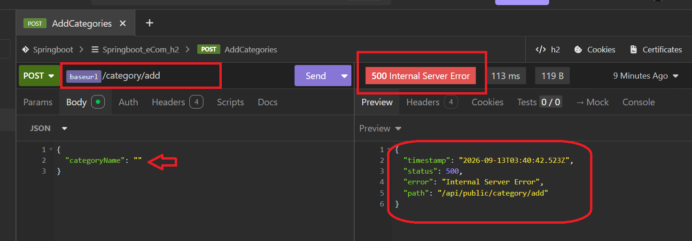
    - but this is not correct, since it is incorrect data, we have to send 400 code and this can be done by **@Valid** annotation which has to pass at **controller** level like below:
    ```java
    @RestController
    @RequestMapping("/category")
    public class CategoryController {

        // BEFORE CODE CHANGE
        @PostMapping("/add")
        public ResponseEntity<String> addCategory( @RequestBody Category category) {
            
            // Category addition logic
        }

        // AFTER CODE CHANGE
        @PostMapping("/add")
        public ResponseEntity<String> addCategory(
            @Valid // <--@Valid is added here-->
            @RequestBody Category category) {
            
            // Category addition logic
        }
    }
    ```
- Now after adding @Valid in controller it becomes like below i.e 400 status code is coming.
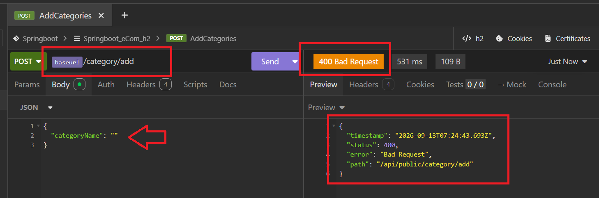


### Exceptions
#### Global Exception Handler:
- In above example, 
    ```java
        public class Category {
        // Update getter and setter to use Long wrapper
        // 1. Change primitive long to wrapper Long object
        @Id
        @GeneratedValue(strategy = GenerationType.IDENTITY, generator = "category_seq")
        private Long id;

        @NotBlank(message = "Category name shouldn't be blank.")
        @Size(min = 5, message = "Category name should be at least of size of 5 characters.")
        private String categoryName;
    }
    ```
- Now still we will get response
    ```json
        {
        "timestamp": "2026-09-13T07:56:31.049Z",
        "status": 400,
        "error": "Bad Request",
        "path": "/api/public/category/add"
    }
    ```
    and on console we will get error and import points are: 
- **MethodArgumentNotValidException** exception with 2 errors:
    - **NotBlank** | default message [Category name shouldn't be blank.]
    - **Size** | default message [Category name should be at least of size of 5 characters.]
    
- Now we can add **GlobalExceptionHandler** with annotation named **@RestControllerAdvice** which will intercept **RestController** APIs when some exception comes.
- Code for Exception handler is as follows:
    ```java
    package com.gomad.h2_jpa.exceptions;

    import org.springframework.http.HttpStatus;
    import org.springframework.http.ResponseEntity;
    import org.springframework.validation.FieldError;
    import org.springframework.web.bind.MethodArgumentNotValidException;
    import org.springframework.web.bind.annotation.ExceptionHandler;
    import org.springframework.web.bind.annotation.RestControllerAdvice;

    import java.util.HashMap;
    import java.util.Map;

    @RestControllerAdvice
    public class MyGlobalExceptionHandler {

        @ExceptionHandler(MethodArgumentNotValidException.class)
        public ResponseEntity<Map<String, String>> myMethodArgumentNotValidException(MethodArgumentNotValidException e){
            Map<String, String> errors = new HashMap<>();

            e.getBindingResult().getAllErrors().forEach(err -> {
                String key = ((FieldError)err).getField();
                String msg = err.getDefaultMessage();

                errors.put(key, msg);
            });
            return new ResponseEntity<>(errors, HttpStatus.BAD_REQUEST);
        }
    }
    ```
- Using **@ExceptionHandler(MethodArgumentNotValidException.class)** we can define like for which exception we can intercept.
    - **@ExceptionHandler(Exception.class)** will intercept all exceptions. 
- With above **GlobalExceptionHandler**, now we can get message like:
    - For request body
        - "categoryName": "", response is 
            - "categoryName": "Category name shouldn't be blank."
        - "categoryName": "a", response is 
            - "categoryName": "Category name should be at least of size of 5 characters."

#### Custom Exceptions:
- In some places, we are using **ResponseStatusException** like:
    ```java
    @Override
    public boolean deleteCategory(Long id) {
        Category categoryToDelete = categoryRepository.findById(id)
                .orElseThrow(() -> new ResponseStatusException(
                        HttpStatus.NOT_FOUND,
                        "Category not found"));

        categoryRepository.delete(categoryToDelete);
        return true;
    }
    ```
- Using **ResponseStatusException** is straight forward but in production ready applications, we will use **Custom exceptions**.
- Why consider Custom Exceptions anyway when ResponseStatusException is there?
    - **Separation of concerns**: Custom exceptions can keep business logic layer clean from web layer constructs.
    - **Consistency & Reusuability**: It makes easier to change the error handling behaviour from one place and making it a centralized place to maintain a standard procedure for throwing errors.
    - **Detailer Error Information**: Custom exceptions give you the flexibility to include additional information [to debug] about the error [like as feedback] other than just error code and status.
    - **Complex Error Handling Logic**: If our apps require some domain specific complex error handling logic to determine the error state, then custom exceptions can encapsulate the logic and it can make our service methods much cleaner, more focused on their primary responsibility.
- Using Custom Exceptions with ResponseStatusException:
    - **ResponseStatusException** for direct feedback: 
        - to provide any detailed direct feedback via controller, we can use this. BUT
    - **Define Custom Exceptions for Business logic**: But if we want customized exceptions for business logic, we make use of Custom Exceptions. SO FOR THAT
    - **Handle Custom Exceptions in Controller Advice**: We can make use of **RestControllerAdvice**, a exception handler method to catch custom exceptions and convert them into relevant or appropriate HTTP responses along with status codes. This approach helps in maintaining Consistency.

#### Some other Custom Exceptions:
- **ResourceNotFoundException** exception: 
    ```java
    package com.gomad.h2_jpa.exceptions;

    public class ResourceNotFoundException extends RuntimeException {

        String resourceName;
        String field;
        String fieldName;
        Long fieldId;
        public ResourceNotFoundException(String resourceName, String field, String fieldName) {
            super(String.format("%s does not have %s: %s", resourceName, fieldName, field));
            this.resourceName = resourceName;
            this.field = field;
            this.fieldName = fieldName;
        }

        public ResourceNotFoundException(String resourceName, String field, Long fieldId) {
            super(String.format("%s does not have %s: %d", resourceName, field, fieldId));
            this.resourceName = resourceName;
            this.field = field;
            this.fieldId = fieldId;
        }

        public ResourceNotFoundException() {
        }
    }
    ```
- Wrapping it as method in **MyGlobalExceptionHandler** class
    ```java
    @ExceptionHandler(ResourceNotFoundException.class)
    public ResponseEntity<String> myResourceNotFoundException(ResourceNotFoundException e){
        return new ResponseEntity<>(e.getMessage(), HttpStatus.NOT_FOUND);
    }
    ```

- Using it in project as: 
    ```java
    public boolean deleteCategory(Long id) {
        Category categoryToDelete = categoryRepository.findById(id)
                .orElseThrow(() -> new ResourceNotFoundException("Category", "CategoryId", id));

        categoryRepository.delete(categoryToDelete);
        return true;
    }
    ```
- Now at any point, if you want to throw, we can throw like object instantiation.
    - new ResourceNotFoundException("Category", "CategoryId", id)
- Now since ResourceNotFoundException extends RunTimeException, it will get intercepted by **MyGlobalExceptionHandler**. 

- **APIException** Exception:
- We can use this like a generic one.
    ```java
    package com.gomad.h2_jpa.exceptions;

    public class APIException extends RuntimeException {
        private final static  long serialVersionUID = 1L;

        public APIException(String message) {
            super(message);
        }
        public APIException(String message, Throwable cause) {

        }
    }
    ```
- Wrapping it as method in **MyGlobalExceptionHandler** class
    ```java
    @ExceptionHandler(APIException.class)
    public ResponseEntity<String> myAPIException(APIException e){
        return new ResponseEntity<>(e.getMessage(), HttpStatus.BAD_REQUEST);
    }
    ```

- Using it in project as: 
    ```java
    @Override
    public List<Category> getAllCategories() {
        List<Category> categories = categoryRepository.findAll();
        if(categories.isEmpty()){
            throw new APIException("No categories found");
        }
        return categories;
    }

    @Override
    public boolean createCategory(Category category) {
        Category existingCategory = categoryRepository.findByCategoryName(category.getCategoryName());
        if(existingCategory != null){
            new APIException("Category with name " + category.getCategoryName() + " already exists !!!");
        }
        categoryRepository.save(category);
        return true;
    }
    ```
- Now at any point, if you want to throw, we can throw like object instantiation.
    - throw new APIException("Category with name " + category.getCategoryName() + " already exists !!!");
    - throw new APIException("No categories found");
- Now since APIException extends RunTimeException, it will get intercepted by **MyGlobalExceptionHandler**. 


### Pagination:
- Request elements be like 
    - page=1&limit=10
- It contains some key response elements like:
    ```json
    {
        "pageNumber": 0,
        "pageSize": 50,
        "totalElements": 11,
        "totalPages": 1,
        "lastPage": true
    }
    ```
- So for page=1&limit=10, response will be like
    ```json
    {
        "content": [
            {
                "id": 1,
                "title": "sunt aut facere repellat provident occaecati excepturi optio reprehenderit",
                "body": "quia et suscipit\nsuscipit recusandae consequuntur expedita et cum\nreprehenderit molestiae ut ut quas totam\nnostrum rerum est autem sunt rem eveniet architecto"
            },
            .........
            {
                "id": 10,
                "title": "optio molestias id quia eum",
                "body": "quo et expedita modi cum officia vel magni\ndoloribus qui repudiandae\nvero nisi sit\nquos veniam quod sed accusamus veritatis error"
            }
        ],
        "pageNumber": 0,
        "pageSize": 10,
        "totalElements": 1000,
        "totalPages": 100,
        "lastPage": false
    }
    ```

### Custom Responses:
- Custom responses/ Custom objects is like a package of data that you create specifically for your end users.
- This is done by DTOs [Data Transfer Objects]

### DTOs [Data Transfer Objects]
- DTO is a designed pattern used to transfer data between software application & sub-systems.
- These are light weight representation of original class objects.
- Entire process looks like:
    - [Category] ==> [Data Transfer Object (DTO)] ==> [JSON]
- DTOs is like a custom object that we have to send as a response to API consumers. 
- Benefits of using DTOs are:
    - They allow to tailor the data i.e if we don't want some fields [like password], we can control that.
    - Using this now we can decouple model from response.
- Entire flow of data packet from request to response in form of DTO is as follows:
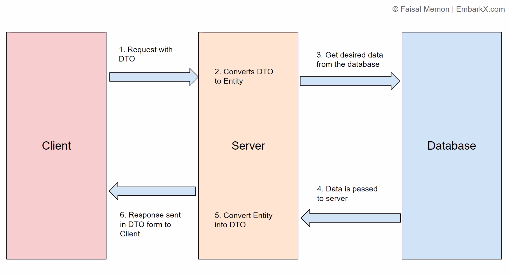
- ##### Implementing DTO Pattern
    - create payload package:
        - for request dtos, create **CategoryDTO** class:
            ```java
            package com.gomad.h2_jpa.payload;

            import lombok.*;

            @Data
            @NoArgsConstructor
            @AllArgsConstructor
            public class CategoryDTO {
                private Long id;
                private String categoryName;
            }
            ```
        - for response dtos, create **CategoryResponse** class:
            ```java
            package com.gomad.h2_jpa.payload;

            import lombok.*;

            @Data
            @AllArgsConstructor
            @NoArgsConstructor
            public class CategoryResponse {
                private List<CategoryDTO> categories;
            }
            ```
        
        - In CategoryService.java:
            ```java
            public interface CategoryService {

            // before:
            List<Category> getAllCategories();

            // After DTO
            CategoryResponse getAllCategories();
            }
            ```
        - Now in CategoryImplementation.java
            ```java

            public class CategoryServiceImplementation implements CategoryService {

                // Before
                @Override
                public List<Category> getAllCategories() {
                    List<Category> categories = categoryRepository.findAll();
                    if(categories.isEmpty()){
                        throw new APIException("No categories found");
                    }
                    return categories;
                }


                // After

                @Autowired
                private CategoryRepository categoryRepository;

                @Override
                public CategoryResponse getAllCategories() {
                    List<Category> categories = categoryRepository.findAll();
                    if(categories.isEmpty()){
                        throw new APIException("No categories found");
                    }
                    return categories;
                }
            }
            ```
        - **return categories;** will be error because return type is not **CategoryResponse**, in this case, typecasting is not the solution, for this **Model Mapping** is used.
- ##### Model Mapping
    - ModelMapper analyzes your object model to intelligently determine how data should be mapped. There's no manual mapping needed. 
    - ModelMapper does most of the work for you, automatically projecting and flattening complex models.
    - Dependency needed is **modelmapper**.
        ```java
        package com.gomad.h2_jpa.config;

        import org.modelmapper.ModelMapper;
        import org.springframework.context.annotation.Bean;
        import org.springframework.context.annotation.Configuration;

        @Configuration
        public class AppConfig {
            
            @Bean
            public ModelMapper modelMapper(){
                return new ModelMapper();
            }
        }
        ```
    - So now CategoryImplementation.java becomes like:
        ```java
        @Service
        public class CategoryServiceImplementation implements CategoryService {

            @Autowired
            private CategoryRepository categoryRepository;

            @Autowired
            private ModelMapper modelMapper;

            @Override
            public CategoryResponse getAllCategories() {
                List<Category> categories = categoryRepository.findAll();
                if(categories.isEmpty()){
                    throw new APIException("No categories found");
                }

                List<CategoryDTO> categoryDTOS = categories.stream()
                        .map(category -> modelMapper.map(category, CategoryDTO.class))
                        .toList();

                CategoryResponse categoryResponse = new CategoryResponse();
                categoryResponse.setCategories(categoryDTOS);
                return categoryResponse;
            }
        }
    - So now controller becomes:
        ```java

        // Before 
        @RequestMapping(value = "/all", method = RequestMethod.GET)
        public ResponseEntity<List<Category>> getCategories(){
            return ResponseEntity.ok().body(categoryService.getAllCategories());
        }

        // After
        @RequestMapping(value = "/all", method = RequestMethod.GET)
        public ResponseEntity<CategoryResponse> getCategories(){
            return ResponseEntity.ok().body(categoryService.getAllCategories());
        }
        ```
    - Now response becomes like:
        - {{baseurl}}/category/all
            ```json
            {
                "categories": [
                    {
                        "id": 1,
                        "categoryName": "Vegetables"
                    },
                    {
                        "id": 2,
                        "categoryName": "Fruits"
                    }
                ]
            }
            ```
    -   CategoryService:
        ```java 
        CategoryDTO createCategory(CategoryDTO categoryDTO);
        ```
    -   CategoryServiceImplementation
        ```java
        @Override
        public CategoryDTO createCategory(CategoryDTO categoryDTO) {
            Category category = modelMapper.map(categoryDTO, Category.class);   // mapping DTO to Model
            CategoryDTO existingCategory = categoryRepository.findByCategoryName(categoryDTO.getCategoryName());
            if(existingCategory != null){
                throw new APIException("Category with name " + categoryDTO.getCategoryName() + " already exists !!!");
            }
            // In case we want to return DTO then
            Category savedCategory = categoryRepository.save(category);
            return modelMapper.map(savedCategory, CategoryDTO.class);  // mapping Model to DTO.
        }
        ```
    - CategoryController
        ```java
        @PostMapping("/add")
        public ResponseEntity<CategoryDTO> addCategory(@Valid @RequestBody CategoryDTO categoryDTO) {
            CategoryDTO savedCategoryDTO = categoryService.createCategory(categoryDTO);
            return new ResponseEntity<>(savedCategoryDTO, HttpStatus.CREATED);
        }
        ```

### Pagination:
- We can directly query for pagination but for that we need some setup.
- Previously we used to fetch all the categories using **findAll()**.
    ```java
    List<Category> categories = categoryRepository.findAll();
    ```
- Now there is a interface named **Pageable** provided by **import org.springframework.data.domain**.
    - **Pageable** is an interface and is implemented by **PageRequest** and it has static method **of**.
    - Now Page is there to handle Generic page data and here it is Category.
    ```java
    Pageable pageable = PageRequest.of(pageNumber, pageSize);
    Page<Category> categoryPage = categoryRepository.findAll(pageable);
    List<Category> categories = categoryPage.getContent();
    ```
- for **/category?pageNumber=0&pageSize=3**
    ```json
        {
        "categories": [
            {
                "id": 1,
                "categoryName": "Fruits"
            },
            {
                "id": 2,
                "categoryName": "Fruits1"
            },
            {
                "id": 3,
                "categoryName": "Fruits2"
            }
        ]
    }
    ```
- for **/category?pageNumber=0&pageSize=1**
    ```json
        {
        "categories": [
            {
                "id": 2,
                "categoryName": "Fruits1"
            }
        ]
    }
    ```
- Note: PageNumber starts with 0.
- #### Default values.
    - If user don't provide pageNumber and pageSize, yet we can disperse data by keeping some default values.
    - Create **AppConstants** in config.
        ```java
        package com.gomad.h2_jpa.config;

        public class AppConstants {
            public static final String PAGE_NUMBER = "0";
            public static final String PAGE_SIZE = "10";
            public static final String SORT_CATEGORY_BY = "id";
            public static final String SORT_DIR = "asc";
        }
        ```
    - Now even if user hits **/category**, it is as same as **/category?pageNumber=0&pageSize=10**
- #### Pagination details:
    - along with content, we need to share page details like 
        ```json
        "pageNumber": 0,
        "pageSize": 50,
        "totalElements": 11,
        "totalPages": 1,
        "lastPage": true
        ```
    - Now in **CategoryResponse**, change 
        ```java
        @Data
        @AllArgsConstructor
        @NoArgsConstructor
        public class CategoryResponse {
            private List<CategoryDTO> categories;
            private Integer pageNumber;
            private Integer pageSize;
            private Long totalElements;
            private Integer totalPages;
            private boolean lastPage;
        }
        ```
    - Now in CategoryImplementation, previously we have created page, using that we can extract corresponding data. Code is
        ```java
        @Override
        public CategoryResponse getAllCategoriesPagination(Integer pageNumber, Integer pageSize) {

            Pageable pageable = PageRequest.of(pageNumber, pageSize);
            Page<Category> categoryPage = categoryRepository.findAll(pageable);
            List<Category> categories = categoryPage.getContent();

            List<CategoryDTO> categoryDTOS = categories.stream()
                    .map(category -> modelMapper.map(category, CategoryDTO.class))
                    .toList();

            CategoryResponse categoryResponse = new CategoryResponse();
            categoryResponse.setCategories(categoryDTOS);
            categoryResponse.setPageNumber(categoryPage.getNumber());
            categoryResponse.setPageSize(categoryPage.getSize());
            categoryResponse.setTotalElements(categoryPage.getTotalElements());
            categoryResponse.setTotalPages(categoryPage.getTotalPages());
            categoryResponse.setLastPage(categoryPage.isLast());

            return categoryResponse;
        }
        ```
    - Here categoryPage has all the required details.
    - for **/category?pageNumber=0&pageSize=2**, response is
        ```json
        {
            "categories": [
                {
                    "id": 1,
                    "categoryName": "Electronics"
                },
                {
                    "id": 2,
                    "categoryName": "Home Appliances"
                }
            ],
            "pageNumber": 0,
            "pageSize": 2,
            "totalElements": 100,
            "totalPages": 50,
            "lastPage": false
        }
        ```
- #### Sorting By and Sorting Order:
    - We can sort by field names and order by ascending [asc] or descending [desc] order.
    - Page provides for ordering and sorting and code changes are:
        ```java
        @Override
        public CategoryResponse getAllCategoriesPagination(Integer pageNumber, Integer pageSize, String sortBy, String sortOrder) {
            Sort sortByAndOrder = sortOrder.equalsIgnoreCase("asc") ?
                    Sort.by(sortBy).ascending()
                    : Sort.by(sortBy).descending();

            Pageable pageable = PageRequest.of(pageNumber, pageSize, sortByAndOrder);

            // other code changes 
        }
        ```
    - Now for ascending order: **/category?pageNumber=0&pageSize=2&sortOrder=asc**
        ```json
        {
            "categories": [
                {
                    "id": 1,
                    "categoryName": "Electronics"
                },
                {
                    "id": 2,
                    "categoryName": "Home Appliances"
                }
            ],
            "pageNumber": 0,
            "pageSize": 2,
            "totalElements": 100,
            "totalPages": 50,
            "lastPage": false
        }
        ```
    - Now for descending order: **/category?pageNumber=0&pageSize=2&sortOrder=desc**
        ```json
        {
            "categories": [
                {
                    "id": 100,
                    "categoryName": "Cleaning Supplies"
                },
                {
                    "id": 99,
                    "categoryName": "Mattresses"
                }
            ],
            "pageNumber": 0,
            "pageSize": 2,
            "totalElements": 100,
            "totalPages": 50,
            "lastPage": false
        }
        ```

#### API Response:
- Currently if I delete category with some id and if that id not exists we are sending **string** message like for **/category/6**
    - Category does not have CategoryId: 6
- If we want to send it like JSON, create some central class like 
    ```java
    package com.gomad.h2_jpa.payload;

    import lombok.*;

    @Data
    @AllArgsConstructor
    @NoArgsConstructor
    public class ApiResponse {

        private String message;
        private boolean status;
    }
    ```
- Now in becomes like
    ```java

    // Before
    @ExceptionHandler(ResourceNotFoundException.class)
    public ResponseEntity<String> myResourceNotFoundException(ResourceNotFoundException e){
        return new ResponseEntity<>(e.getMessage(), HttpStatus.NOT_FOUND);
    }

    // After
    @ExceptionHandler(ResourceNotFoundException.class)
    public ResponseEntity<ApiResponse> myResourceNotFoundException(ResourceNotFoundException e){
        ApiResponse apiResponse = new ApiResponse(e.getMessage(), false);
        return new ResponseEntity<>(apiResponse, HttpStatus.NOT_FOUND);
    }

    // Before
    @ExceptionHandler(APIException.class)
    public ResponseEntity<String> myAPIException(APIException e){
        return new ResponseEntity<>(e.getMessage(), HttpStatus.BAD_REQUEST);
    }

    // After
    @ExceptionHandler(APIException.class)
    public ResponseEntity<ApiResponse> myAPIException(APIException e){
        ApiResponse apiResponse = new ApiResponse(e.getMessage(), false);
        return new ResponseEntity<>(apiResponse, HttpStatus.BAD_REQUEST);
    }
    ```
- Responses now for **/category/6**
    ```json

    // before:
    Category does not have CategoryId: 6

    // After
    {
        "message": "Category does not have CategoryId: 6",
        "status": false
    }
    ```

### Multiple Entities

- ##### JPA & Relationships:
    - An entity represents a table in database.
    - Each instance of an entity corresponds to a row in that table.
    - Relationships in JPA define how entities are related to each other.
    - JPA allows you to map those relationships using annotations in java code.
    - Example: If you have a table for storing info about books, each book object would be a row.
- ##### Relationships:
    - One to One
    - One to Many (or) Many to One
    - Many to Many
    - ###### One to One Relationship:
        - It is atype of relationship where in one record in a table is related to exactly one more record in another table and vice versa.
        - Example: 
            - One Employee and One Salary Account
                [Employee] ===> [Salary Account]
            - One Person and One Passport
                [Person] ===> [Passport]
    - ###### One to Many Relationship:
        - In this relationship, one record in one table has one or many related records in another table.
        - Example:
            - One Customer and Multiple Orders.
                [Customer] ===> [Orders]
            - One User and Multiple Bank Accounts.
                [User] ===> [Bank Accounts]
    - ###### Many to Many Relationships:
        - In this relationship, one record in one table has many  related records in another table.
        - Example:
            - One Customer can order Multiple Products and One Product Can be Ordered by Many Customers.
                [Customer(s)] <===> [Product(s)]
            - Courses and Students.
                [Course(s)] <===> [Student(s)]
    - Directionality in Relationships:
        - Unidirectional Relationship.
        - Bidirectional Relationship.
    - ###### Unidirectional Relationship.
        - In this relationship, when only one entity knows about the relationship.
        - For example, 2 entities Customer and Orders and if unidirectional relationship established between these terms from Customer to Orders, then in database terms, it also means:
            - you can navigate from one entity to another, but not from the other way around.
    - ###### Bidirectional Relationship.
        - In this relationship, where both the entities are aware of each other that relationship exists.
        - Example: Again Order and Order details entities. In database terms you can navigate the relationship from either of the entities.
- ##### One to One Coding:
    - Here we setup SocialUser to SocialProfile.
    - SocialUser:
        ```java
        package com.gomad.social_media.models;

        @Entity
        public class SocialUser {

            @Id
            @GeneratedValue(strategy = GenerationType.IDENTITY)
            private Long id;
        }
        ```
    - SocialProfile
        ```java
        package com.gomad.social_media.models;

        @Entity
        public class SocialProfile {

            @Id
            @GeneratedValue(strategy = GenerationType.IDENTITY)
            private Long id;

            @OneToOne
            private SocialUser user;
        }
        ```
    - Here using **@OneToOne**, we have established One-to-One relationship between SocialUser and SocialProfile.
        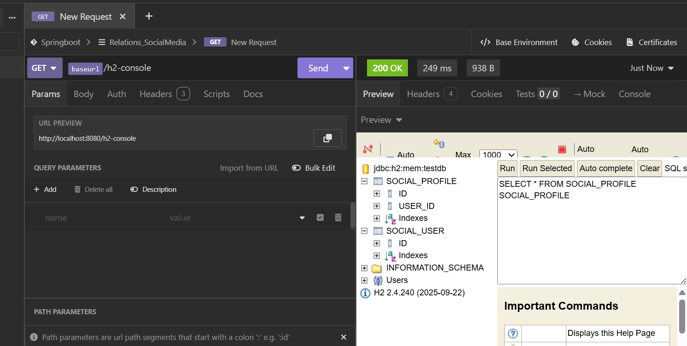
    - Here SOCIAL_PROFILE has
        - ID [of SOCIAL_PROFILE]
        - USER_ID [acts as foreign key for SOCIAL_USER] and this we can control using **JoinColumn**.
    - Code change is:
        ```java
        @OneToOne
        @JoinColumn(name = "social_user")
        private SocialUser user;
        ```
        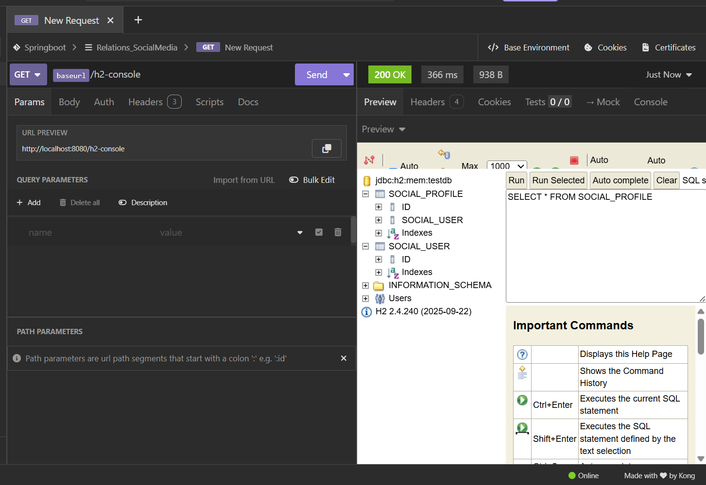
    - Now **USER_ID** changed to **SOCIAL_USER** corresponding to **social_user** given in **JoinColumn**.
    - ###### Bi-Directional in One-to-One relationship.
        - Add below code in SocialUser and create one-to-one with SocialProfile
            ```java
            @OneToOne
            @JoinColumn(name = "social_profile")
            private SocialProfile socialProfile;
            ```
            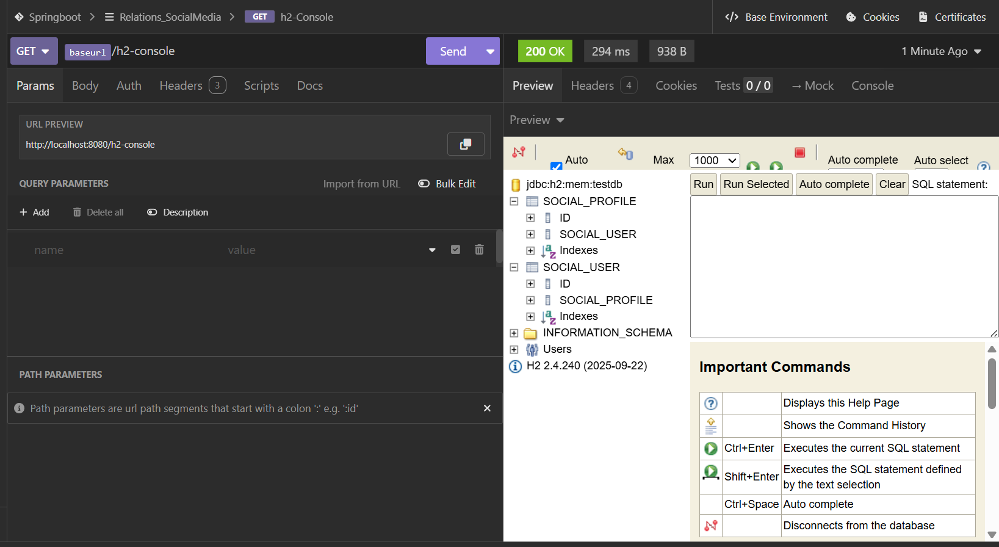
        - Issue: Now each table has one foreign key to another. Issue is there are redundant foreign key columns. And both the entities are managing the relationship independently and there could be confusion when working with this data as queries might get error prone as to which foreign key to use.
            - SO here we have to make any one as owner and here we make **SocialUser** as owner. Code changes are:
                ```java
                // In SocialProfile:
                @OneToOne(mappedBy = "socialProfile")
                // @JoinColumn(name = "social_user")
                private SocialUser user;

                // In SocialUser: No Code Changes
                @OneToOne
                @JoinColumn(name = "social_profile")
                private SocialProfile socialProfile;
                ```
            - So in SocialProfile:
                - **mappedBy = "socialProfile"** is added and this **socialProfile** should be as same as **private SocialProfile socialProfile;**
                - Remove **JoinColumn** since no foreign key will come in SocialProfile.
                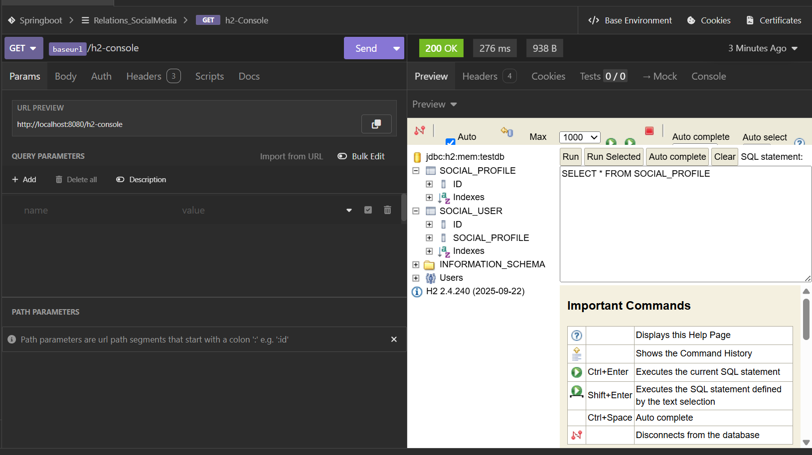
                - Now no **foreign key** in Social_Profile.
            - If you want no foreign key in SocialUser, then changes are:
                ```java
                // In SocialProfile: No Code Changes
                @OneToOne
                @JoinColumn(name = "social_user")
                private SocialUser user;

                // In SocialUser: All Changes here only
                @OneToOne(mappedBy = "user")
                // @JoinColumn(name = "social_profile")
                private SocialProfile socialProfile;
                ```
                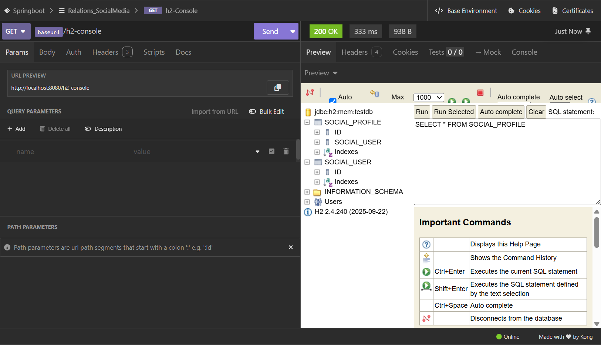


- ##### One to Many & Many to One Relationships:
    - [User] ===> [Posts]
    - Coding part is:
    - Post.java
        ```java
        package com.gomad.social_media.models;

        @Entity
        public class Post {

            @Id
            @GeneratedValue(strategy = GenerationType.IDENTITY)
            private Long id;
        }
        ```
    - SocialUser.java
        ```java
        package com.gomad.social_media.models;

        import jakarta.persistence.*;

        import java.util.ArrayList;
        import java.util.List;

        @Entity
        public class SocialUser {

            @Id
            @GeneratedValue(strategy = GenerationType.IDENTITY)
            private Long id;

            @OneToOne(mappedBy = "user")
            private SocialProfile socialProfile;

            @OneToMany
            private List<Post> posts = new ArrayList<>();
        }
        ```
        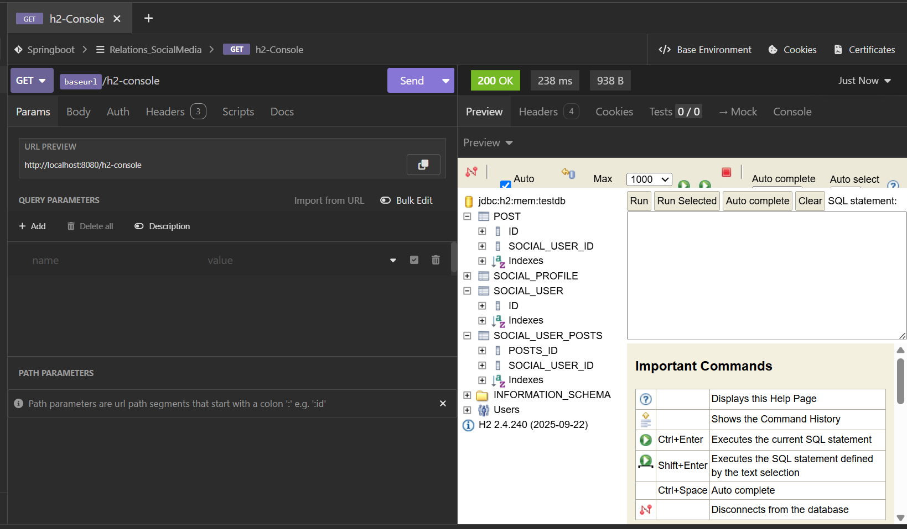
    - It creates some extra table **SOCIAL_USER_POSTS** is created automatically with columns: 
        - POSTS_ID [a foreign key linking to posts]
        - SOCIAL_USER_ID [a foreign key linking yo social user]
        - This table is having foreign key relationship to the post as well as to user over here.
        - This extra table can be removed by making either Post or SocialUser as owner.
    - Code change:
        ```java
        // SocialUser.java
        @Entity
        public class SocialUser {

            @OneToMany(mappedBy = "socialUser")
            private List<Post> posts = new ArrayList<>();
        
        }

        // Post.java
        @Entity
        public class Post {

            @Id
            @GeneratedValue(strategy = GenerationType.IDENTITY)
            private Long id;

            @ManyToOne // Means Many Posts mapped to one SocialUser
            @JoinColumn(name = "user_id")
            private SocialUser socialUser;
        }
        ```
    - Now that extra table is removed like as in image:
        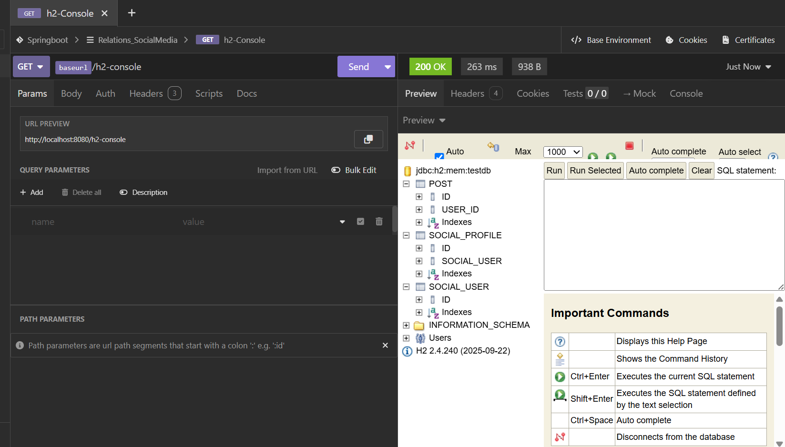
        - Image understanding: One User, with user_id, posts a post, with post_id and it have user_id, which again tracks back to User only.
    - With this, system can know how many posts a user has done and which post is being done by which user. So it is a **bidirectional relationship**. 